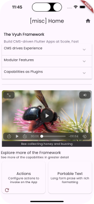
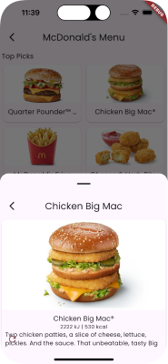
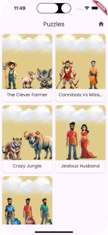

  
  <h1 align="center">Vyuh Framework</h1>
  
Build Modular, Scalable, CMS-driven Flutter Apps

  <h4 align="center">
    <a href="https://docs.vyuh.tech">Docs</a> |
    <a href="https://vyuh.tech">Website</a>
  </h4>

&nbsp;

&nbsp;

&nbsp;

| Packages                                                                                                                                                                                                                                                        |
| :-------------------------------------------------------------------------------------------------------------------------------------------------------------------------------------------------------------------------------------------------------------- |
| _Sanity Integration_                                                                                                                                                                                                                                            |
|                                                                                          |
|                              |
| _Vyuh_                                                                                                                                                                                                                                                          |
|                                                                                                          |
|                                                      |
|  |
|                                                                                                      |
|                                                                  |
|                                                      |
|                                                                          |
|                                                  |
| _NPM_                                                                                                                                                                                                                                                           |
|                                |
|                        |
|            |
|                                |
|        |

## Hi there! 👋

**Vyuh** is a framework to build CMS-driven Flutter Apps at scale. It gives the
**no-code** flexibility to the Business teams (via the CMS), and the
**full-code** power to the Engineering teams. This puts the right control at the
right place without any compromise.

> [!NOTE]
>
> CMS is one of the many extensible integrations inside Vyuh. All integrations
> are managed as Plugins, which are standardized interfaces to extend the
> capabilities of the framework.

## 🤔 Why did we build this?

A common problem when building large scale apps is the _need to stay modular_ as
you keep growing the feature set. You also want different teams to _work in
parallel_ without stepping on each other. The typical approach of creating a
single project and building all the functionality in it does not scale very well
over time. You could break up the app into several packages but that still does
not give you the clarity of who owns what. It does not tell you how to combine
these packages to create the final app.

Additionally, Apps today are very content-oriented and need to be dynamic. This
means your journeys, page content, themes, etc. should be remotely controllable.
In other words, making your app _Server-driven_.

### Separation of Concerns

Combining all these capabilities requires a holistic approach, which is only
possible when you build a cohesive framework.

> **Vyuh** is that framework.
>
> It allows you to create the perfect balance of simple, modular components on
> the `CMS`, with powerful `Flutter` counterparts that take care of all the
> complexity.

The teams (Business teams) managing the content and experience don't have to
worry about UI Design, pixel precision or performance and focus more on
_building the screen journeys and page content_ instead. The Flutter engineering
teams handle the complexity of the components along with its performance.

This clear separation allows a phenomenal flexibility in building simple to
large scale apps. It also gives _the right tools to the right teams_ and makes
them more productive.

> _Business_ teams **assemble** page-content and journeys, whereas the
> _Engineering_ teams focus on the **developing** the design, performance and
> scalability of those _content-blocks_. This results in a _gallery of blocks_
> which the Business teams use to create the content of the App.

### The Framework

The **Vyuh** framework has some powerful built-in capabilities such as:

- [x] Building features atomically and in a modular fashion.
- [x] Features as transferable and reusable units of functionality that can be
      moved between Apps.
- [x] Remote configuration of content, enabling Server-Driven UI.
- [x] Extensible Plugin-based approach to add new third-party integrations.
- [x] Team Independence.
- [x] Decentralised development.
- [x] Creating a family of apps with reusable features.
- [x] A growing set of integrations (aka building blocks) to make app
      development faster.

## 🔩 The Building Blocks

The core building blocks that enable all of this include:

- **Features**: build user-facing functionality in a modular, reusable, atomic
  manner. Features can be composed together to create the entire app or a family
  of apps. Features can also be transferred between apps easily.
- **Plugins**: All third party integrations are handled in a cross-cutting
  manner using Plugins. Authentication, Networking, CMS, Storage, Permissions,
  Ads, etc. are all plugins that are available to all features.
- **CMS-Driven UI**: Also known as Server-Driven UI, the entire app experience
  can be driven from a CMS. This includes the screen journeys, page content,
  themes, etc. The CMS itself is a standard plugin with custom Providers. Bring
  your own CMS as a `ContentProvider`!

> [!NOTE]
>
> The default CMS we use is [Sanity.io](https://sanity.io).

- **Community packages**: leverages the best community packages like `mobx`,
  `go_router`, `get_it`, `hive`, `firebase`, etc. This means you don't have to
  learn anything proprietary to use Vyuh.

> It is plain old Flutter with a fresh approach to building scalable apps.

## Getting Started 🚀

1. Start with the documentation on the [Docs Website](https://docs.vyuh.tech).
2. There are several examples to give you a taste of the Framework. Check them
   out in the [examples](examples) directory. Some direct links to the examples
   are listed below.
3. To run the Vyuh Demo, there is some setup needed. This includes API Keys for
   Unsplash and TMDB. All these details are in the
   [Vyuh Demo README](apps/vyuh_demo/README.md).

### Examples

<table>
  <tbody>
    <tr>
      <td>
        
         
        <a href="examples/feature_sample/lib/features/feature_counter.dart">Counter</a>
         
        The classic counter example from Flutter, as a Vyuh Feature.
      </td>
      <td>
        
         
        <a href="examples/feature_sample/lib/features/feature_settings.dart">Theme Settings</a>
         
        Toggle between the light & dark themes.
      </td>
    </tr>
    <tr>
      <td>
        
         
        <a href="examples/wonderous">Wonderous</a>
         
        The Wonderous App as a feature.
      </td>
      <td>
        
         
        <a href="examples/tmdb">Movies</a>
         
        A Movies feature using the TMDB API.
      </td>
    </tr>
    <tr>
      <td>
        
         
        <a href="examples/unsplash">Unsplash</a>
         
        Explore the photos from Unsplash
      </td>
      <td>
        
         
        <a href="examples/misc">Miscellaneous</a>
         
        Explore the various framework capabilities in this miscellaneous feature.
      </td>
    </tr>
    <tr>
      <td>
        
         
        <a href="examples/food">Food</a>
         
        A fast-food menu feature
      </td>
      <td>
        
         
        <a href="examples/puzzles">Puzzle</a>
         
        A fun little puzzle game, as a feature.
      </td>
    </tr>
  </tbody>
</table>

## Contact

Follow us, stay up to date or reach out on:

- [@vyuh_tech](https://x.com/vyuh_tech)
- [LinkedIn](https://www.linkedin.com/company/vyuh-tech)
- [Discord](https://discord.gg/b49sbjqszG)
- [Email](mailto:ask@vyuh.tech)

## Analytics

## Contributors

<!-- ALL-CONTRIBUTORS-LIST:START - Do not remove or modify this section -->
<!-- prettier-ignore-start -->
<!-- markdownlint-disable -->
<table>
  <tbody>
    <tr>
      <td align="center" valign="top" width="20%"><a href="https://vyuh.tech/"> <b>Pavan Podila</b></a> <a href="https://github.com/vyuh-tech/vyuh/commits?author=pavanpodila" title="Code">💻</a> <a href="https://github.com/vyuh-tech/vyuh/commits?author=pavanpodila" title="Documentation">📖</a></td>
      <td align="center" valign="top" width="20%"><a href="https://github.com/vishal-kr-barnwal"> <b>Vishal Kumar</b></a> <a href="https://github.com/vyuh-tech/vyuh/commits?author=vishal-kr-barnwal" title="Code">💻</a></td>
      <td align="center" valign="top" width="20%"><a href="https://github.com/ProjectAJ14"> <b>Ajay Kumar</b></a> <a href="https://github.com/vyuh-tech/vyuh/commits?author=ProjectAJ14" title="Code">💻</a> <a href="https://github.com/vyuh-tech/vyuh/commits?author=ProjectAJ14" title="Tests">⚠️</a></td>
    </tr>
  </tbody>
</table>

<!-- markdownlint-restore -->
<!-- prettier-ignore-end -->

<!-- ALL-CONTRIBUTORS-LIST:END -->

## License

The framework is [FSL Licensed](LICENSE).
