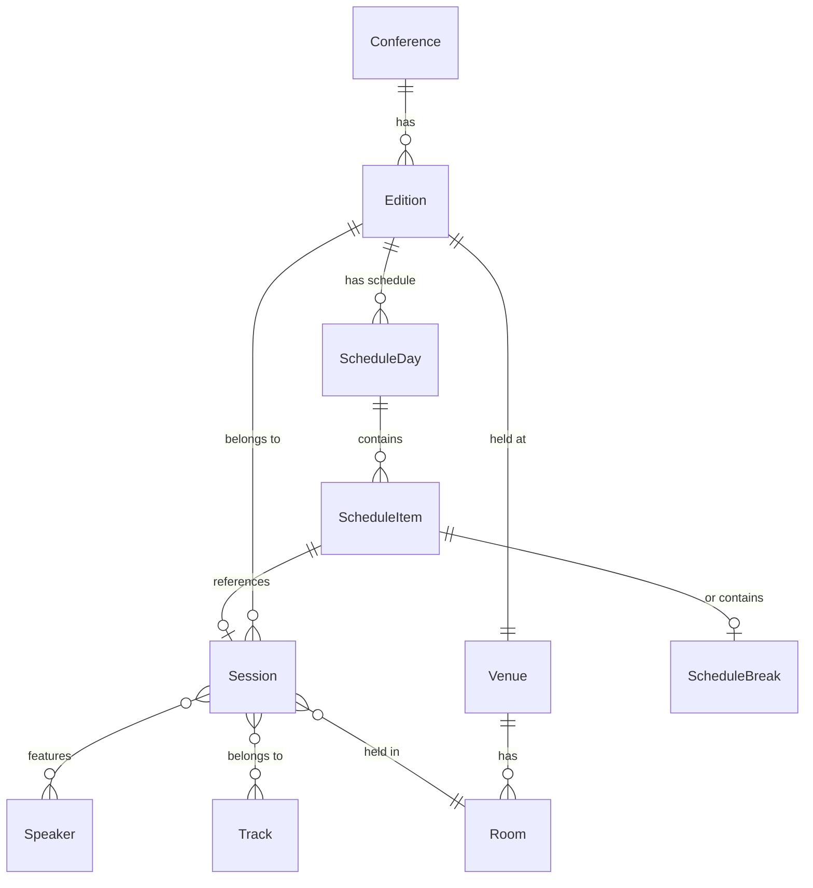

# Conference Schema Relationships

## Entity Relationship Diagram



## Document Types

### Conference (conf.conference)
- Has many Editions (1:N)
```
Conference --[1:N]--> Edition
```

### Edition (conf.edition)
- Belongs to one Conference (N:1)
- Has one Venue (N:1)
- Has many Schedule Days (1:N)
```
Edition --[N:1]--> Conference
Edition --[N:1]--> Venue
Edition --[1:N]--> ScheduleDay
```

### Session (conf.session)
- Belongs to one Edition (N:1)
- Has many Speakers (N:N)
- Has many Tracks (N:N)
- Has one Room (N:1)
```
Session --[N:1]--> Edition
Session --[N:N]--> Speaker
Session --[N:N]--> Track
Session --[N:1]--> Room
```

### Speaker (conf.speaker)
- Referenced by many Sessions (N:N)
```
Speaker <--[N:N]--> Session
```

### Track (conf.track)
- Referenced by many Sessions (N:N)
```
Track <--[N:N]--> Session
```

### Venue (conf.venue)
- Referenced by many Editions (1:N)
- Has many Rooms (1:N)
```
Venue <--[N:1]-- Edition
Venue --[1:N]--> Room
```

## Object Types

### Room (conf.room)
- Belongs to one Venue (N:1)
- Referenced by many Sessions (1:N)
```
Room --[N:1]--> Venue
Room <--[1:N]-- Session
```

### ScheduleDay (conf.schedule.day)
- Belongs to one Edition (N:1)
- Has many Schedule Items (1:N)
```
ScheduleDay --[N:1]--> Edition
ScheduleDay --[1:N]--> ScheduleItem
```

### ScheduleItem
- Can be either:
  - Session Reference (N:1)
  - Break Period (embedded)
```
ScheduleItem --[N:1]--> Session
ScheduleItem --[1:1]--> ScheduleBreak
```

## Key Relationships

1. Conference -> Edition -> Schedule
   - Conference has many editions
   - Each edition has its own schedule days
   - Schedule days contain session references and breaks

2. Session -> Speaker/Track/Room
   - Sessions are linked to multiple speakers and tracks
   - Each session is assigned to a specific room
   - All sessions belong to a specific edition

3. Venue -> Room -> Session
   - Venues contain multiple rooms
   - Rooms are referenced by sessions
   - Venues are linked to editions

## Query Patterns

1. Get all speakers for an edition:
```groq
*[_type == "conf.speaker" && _id in array::unique(
  *[_type == "conf.session" && edition._ref == $editionId] {
    "speakers": speakers[]->{_id}._id,
  }.speakers[]
)]
```

2. Get all tracks for an edition:
```groq
*[_type == "conf.track" && _id in array::unique(
  *[_type == "conf.session" && edition._ref == $editionId] {
    "tracks": tracks[]->{_id}._id,
  }.tracks[]
)]
