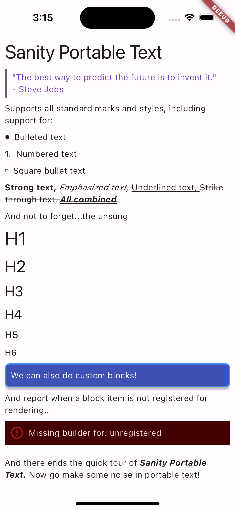

# Flutter Widget for rendering Sanity's Portable Text

[](https://pub.dev/packages/flutter_sanity_portable_text)

Renders the [Portable Text format](https://github.com/portabletext/portabletext)
in Flutter.

## Features

- Render all standard styles and marks
- Render multiple blocks of text
- Includes supports for custom blocks
- Supports custom styles and marks including gestures



## Usage

The following code shows the various ways of using this package:

```dart
import 'package:flutter/material.dart';
import 'package:flutter_sanity_portable_text/flutter_sanity_portable_text.dart';

// A custom block item that will not be registered for rendering
final class UnregisteredBlockItem implements PortableBlockItem {
  @override
  String get blockType => 'unregistered';
}

// A custom block item that will be registered for rendering
final class CustomBlockItem implements PortableBlockItem {
  CustomBlockItem({
    required this.text,
    required this.foregroundColor,
    required this.backgroundColor,
  });

  @override
  String get blockType => 'custom';

  final String text;
  final Color foregroundColor;
  final Color backgroundColor;
}

void main() {
  // Registering a custom block
  PortableTextConfig.shared.blocks['custom'] = (context, item) {
    final theme = Theme.of(context);
    final custom = item as CustomBlockItem;
    final style =
        theme.textTheme.bodyMedium?.apply(color: custom.foregroundColor);

    return Container(
      decoration: BoxDecoration(
          color: custom.backgroundColor,
          borderRadius: BorderRadius.circular(8),
          border: Border.all(color: Colors.blueAccent, width: 2),
          boxShadow: const [
            BoxShadow(
              offset: Offset(0, 4),
              blurRadius: 2,
              color: Colors.black26,
            )
          ]),
      margin: const EdgeInsets.only(bottom: 8),
      padding: const EdgeInsets.all(8),
      child: Text(custom.text, style: style),
    );
  };

  runApp(const MyApp());
}

class MyApp extends StatelessWidget {
  const MyApp({super.key});

  @override
  Widget build(BuildContext context) {
    return MaterialApp(
      title: 'Flutter Demo',
      theme: ThemeData(
        colorScheme: ColorScheme.fromSeed(seedColor: Colors.deepPurple),
        useMaterial3: true,
      ),
      home: Scaffold(
        body: SafeArea(
          child: Padding(
            padding: const EdgeInsets.all(8.0),
            child: PortableText(
              blocks: [
                TextBlockItem(
                  children: [
                    Span(
                      text: 'Sanity Portable Text',
                    ),
                  ],
                  style: 'h1',
                ),

                // Let's try a blockquote now
                TextBlockItem(
                  children: [
                    Span(
                      text:
                          '"The best way to predict the future is to invent it."',
                    ),
                    Span(
                      text: '\n- Steve Jobs',
                    ),
                  ],
                  style: 'blockquote',
                ),

                TextBlockItem(
                  children: [
                    Span(
                      text:
                          'Supports all standard marks and styles, including support for:',
                    ),
                  ],
                ),

                _listItem('Bulleted text', ListItemType.bullet),
                _listItem('Numbered text', ListItemType.number),
                _listItem('Square bullet text', ListItemType.square),
                TextBlockItem(
                  children: [
                    _span('Strong text, ', marks: ['strong']),
                    _span('Emphasized text, ', marks: ['em']),
                    _span('Underlined text, ', marks: ['underline']),
                    _span('Strike through text, ', marks: ['strike-through']),
                    _span('All combined',
                        marks: ['strong', 'em', 'underline', 'strike-through']),
                    _span('.'),
                  ],
                ),
                _textBlock('And not to forget...the unsung'),
                for (final index in [1, 2, 3, 4, 5, 6])
                  _textBlock('H$index', style: 'h$index'),
                CustomBlockItem(
                    text: 'We can also do custom blocks!',
                    foregroundColor: Colors.white,
                    backgroundColor: Colors.primaries[4]),
                _textBlock(
                    ('And report when a block item is not registered for rendering..')),
                UnregisteredBlockItem(),
                TextBlockItem(children: [
                  Span(text: '\nAnd there ends the quick tour of '),
                  Span(text: 'Sanity Portable Text. ', marks: ['strong', 'em']),
                  Span(text: 'Now go make some noise in portable text!'),
                ])
              ],
            ),
          ),
        ),
      ),
    );
  }

  TextBlockItem _textBlock(String text, {String? style}) {
    return TextBlockItem(
      children: [
        Span(text: text),
      ],
      style: style ?? 'normal',
    );
  }

  TextBlockItem _listItem(String text, ListItemType type) {
    return TextBlockItem(
      children: [
        Span(text: text),
      ],
      listItem: type,
    );
  }

  _span(String text, {List<String>? marks}) {
    return Span(text: text, marks: marks ?? []);
  }
}

```
