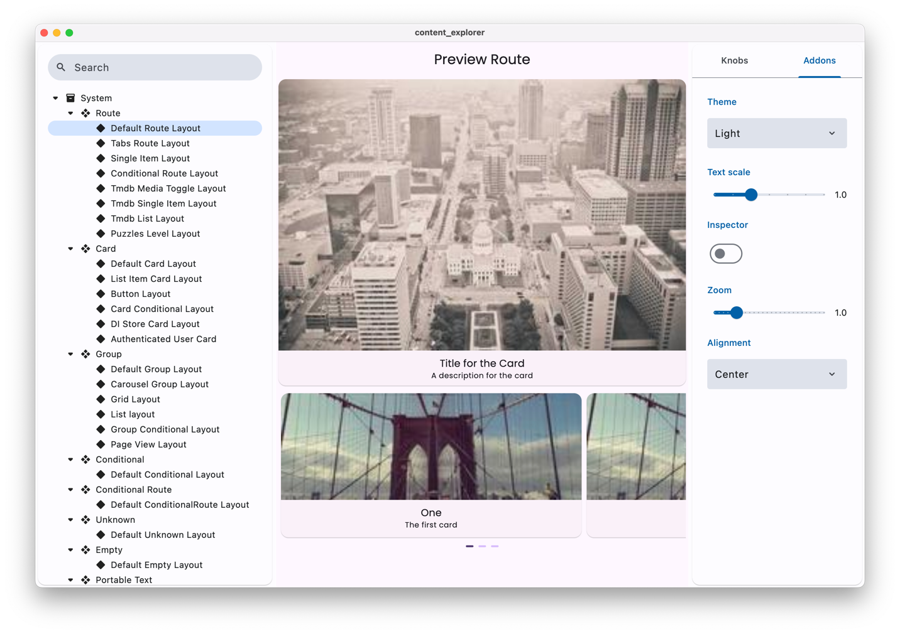

<p align="center">
  <a href="https://vyuh.tech">
    
  </a>
  <h1 align="center">Vyuh Framework</h1>
  <p align="center">Build Modular, Scalable, CMS-driven Flutter Apps</p>
  <p align="center">
    <a href="https://docs.vyuh.tech">Docs</a> |
    <a href="https://vyuh.tech">Website</a>
  </p>
</p>

# Vyuh Widgetbook 📚

[](https://pub.dev/packages/vyuh_widgetbook)

A powerful widgetbook implementation for previewing Vyuh content and components.
Built on top of [widgetbook](https://pub.dev/packages/widgetbook), this package
provides a seamless way to preview and test your Vyuh content types in
isolation.



## ✨ Features

- 📱 Preview content types in different sizes
- 🌓 Toggle between light and dark themes
- 🎯 Test content types in isolation
- 🔍 Navigate through features and their content types
- 🎭 Preview different layouts for each content type

## 📦 Installation

```yaml
dependencies:
  vyuh_widgetbook: ^1.0.0
```

## 🚀 Usage

Create a new Flutter app and use `runWidgetBook` to start the widgetbook:

```dart
import 'package:flutter/widgets.dart';
import 'package:vyuh_widgetbook/vyuh_widgetbook.dart';
import 'package:vyuh_feature_system/vyuh_feature_system.dart' as system;
import 'package:feature_one/feature_one.dart' as feature1;
import 'package:feature_two/feature_two.dart' as feature2;
import 'package:feature_three/feature_three.dart' as feature3;

void main() {
  runWidgetBook(
    features: () => [
      // Add your features here
      system.feature,
      feature1.feature,
      feature2.feature,
      feature3.feature,
    ],
    // Optional: Customize themes
    lightTheme: YourThemeData.light,
    darkTheme: YourThemeData.dark,
  );
}
```

## 📚 Documentation

For detailed documentation and guides, visit:

- [Vyuh Documentation](https://docs.vyuh.tech)
- [Content Previews Guide](https://docs.vyuh.tech/guides/cms/previews)
- [Widgetbook Integration](https://docs.vyuh.tech/guides/cms/widgetbook)

## 🤝 Contributing

Contributions are welcome! Please read our
[contributing guidelines](https://github.com/vyuh-tech/vyuh/blob/main/CONTRIBUTING.md)
to get started.

## 📚 Learn More

- Visit [docs.vyuh.tech](https://docs.vyuh.tech) for detailed documentation
- Check out the [GitHub repository](https://github.com/vyuh-tech/vyuh) for
  source code
- Report issues on the [issue tracker](https://github.com/vyuh-tech/vyuh/issues)

---

<p align="center">Made with ❤️ by <a href="https://vyuh.tech">Vyuh</a></p>
