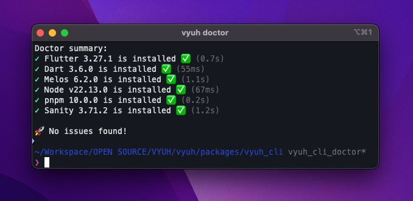
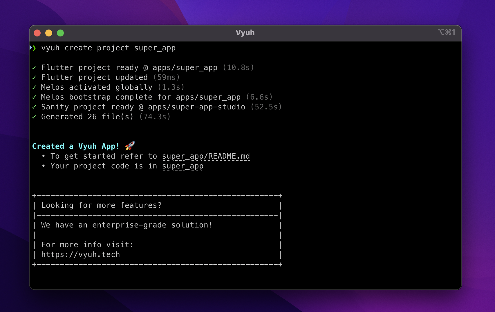

<p align="center">
  <a href="https://vyuh.tech">
    
  </a>
  <h1 align="center">Vyuh Framework</h1>
  <p align="center">Build Modular, Scalable, CMS-driven Flutter Apps</p>
  <p align="center">
    <a href="https://docs.vyuh.tech">Docs</a> |
    <a href="https://vyuh.tech">Website</a>
  </p>
</p>

# vyuh_cli

[](https://pub.dev/packages/vyuh_cli)

A command-line interface for the Vyuh Framework to generate Vyuh projects from
predefined templates.

# Documentation 📝

For official documentation, please visit https://docs.vyuh.tech/

# Quick Start 🚀

## Installing 🧑‍💻

```sh
dart pub global activate vyuh_cli
```

Or install a [specific version](https://pub.dev/packages/vyuh_cli/versions)
using:

```sh
dart pub global activate vyuh_cli <version>
```

> If you haven't already, you might need to
> [set up your path](https://dart.dev/tools/pub/cmd/pub-global#running-a-script-from-your-path).

When that is not possible (eg: CI environments), run `vyuh` commands via:

```sh
dart pub global run vyuh_cli:vyuh <command> <args>
```

# Commands ✨

## `vyuh doctor`

Vyuh Doctor is a command-line tool that helps developers set up and troubleshoot
their Vyuh development environment.

- Ensure that the required software is installed
- Diagnose issues and provide recommendations

```sh
vyuh doctor
```



## `vyuh create`

Create a Vyuh project in seconds based on the predefined template. Each template
has a corresponding sub-command ( e.g.,`vyuh create project`).



```sh
Creates Vyuh projects, features, and CMS schemas.

Usage: vyuh create <subcommand> <item-name> [arguments]
-h, --help    Print this usage information.

Available subcommands:
  feature                 A Vyuh feature created by Vyuh CLI.
  schema                  A Vyuh feature CMS schema created by Vyuh CLI.
  project                 A Vyuh Flutter project created by Vyuh CLI.

Run "vyuh help" to see global options.
```

## Usage

### Create projects

Creates a new Vyuh project with the given name.

```sh
vyuh create project <project-name>

```

```sh
A Vyuh Flutter project created by Vyuh CLI.

Usage: vyuh create project <project-name> [arguments]
-h, --help                Print this usage information.
-o, --output-directory    The desired output directory when creating a new project.
    --description         The description for this new project.
                          (defaults to "A Vyuh Flutter project created by Vyuh CLI.")
    --cms                 The content management system for this new project.
                          (defaults to "sanity")
    --org-name            The organization for this new project.
                          (defaults to "com.example.vyuh")
    --application-id      The bundle identifier on iOS or application id on Android. (defaults to <org-name>.<project-name>)
```

### Create features

Creates a new Vyuh feature with the given name.

```sh
vyuh create feature <feature-name>
```

```sh
A Vyuh feature created by Vyuh CLI.

Usage: vyuh create feature <feature-name> [arguments]
-h, --help                Print this usage information.
-o, --output-directory    The desired output directory when creating a new feature.
```

### Create schemas

Creates a new Vyuh feature CMS schema with the given name.

```sh
vyuh create schema <feature-name>
```

```sh
A Vyuh feature CMS schema created by Vyuh CLI.

Usage: vyuh create schema <feature-name> [arguments]
-h, --help                Print this usage information.
-o, --output-directory    The desired output directory when creating a new feature.
    --cms                 The content management system for this new schema.
                          (defaults to "sanity")
```

# Contact

Follow us, stay up to date or reach out on:

- [@vyuh_tech](https://x.com/vyuh_tech)
- [LinkedIn](https://www.linkedin.com/company/vyuh-tech)
- [Discord](https://discord.gg/b49sbjqszG)
- [Email](mailto:ask@vyuh.tech)

---

<p align="center">Made with ❤️ by <a href="https://vyuh.tech">Vyuh</a></p>

[docs_link]: https://docs.vyuh.tech/
